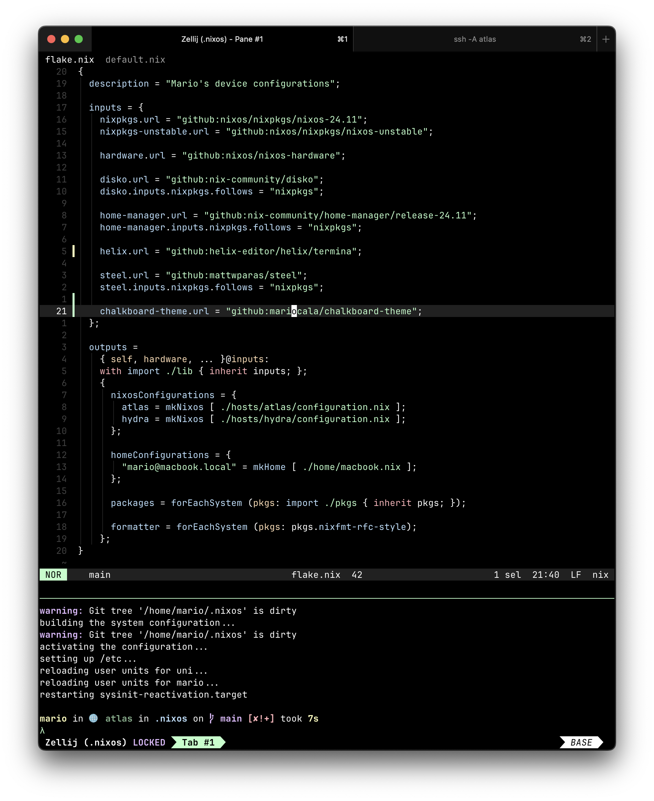

# Chalkboard Theme for Nix


|  |
|:--:|
| Screenshot showcasing the Theme for [Helix](https://github.com/helix-editor/helix), [Zellij](https://github.com/zellij-org/zellij) & [Ghostty](https://github.com/ghostty-org/ghostty) |


## Usage with Flakes

> [!NOTE]  
> The following flake example is incomplete. It's supposed to highlight the changes
> necessary to use this theme module with home-manager.

```diff
{
  inputs = {
    nixpkgs.url = "github:nixos/nixpkgs/nixos-unstable";
    home-manager.url = "github:nix-community/home-manager";
+   chalkboard-theme.url = "github:mariocala/chalkboard-theme";
  };

  outputs = {
    nixpkgs
    home-manager
+   chalkboard-theme
  }: {
    # When using home-manager with NixOS module
    nixosConfigurations.foo = pkgs.lib.nixosSystem {
      modules = [
        home-manager.nixosModules.home-manager
        {
          home-manager.users.bar = {
            imports = [
+             chalkboard-theme.homeModules.chalkboard-theme
            ];
          };
        }
      ];
    };

    # When using standalone home-manager setup
    homeConfigurations.foo = home-manager.lib.homeManagerConfiguration {
      modules = [
+       chalkboard-theme.homeModules.chalkboard-theme
      ];
    };
  };
}
```

## Home configuration

Enable for individual programs

```nix
{
  chalkboard-theme.helix.enable = true;
}
```

or for all supported programs and disable individually

```nix
{
  chalkboard-theme.enable = true;
  chalkboard-theme.helix.enable = false;
}
```

## Acknowledgements

- project inspired by https://github.com/catppuccin/nix
